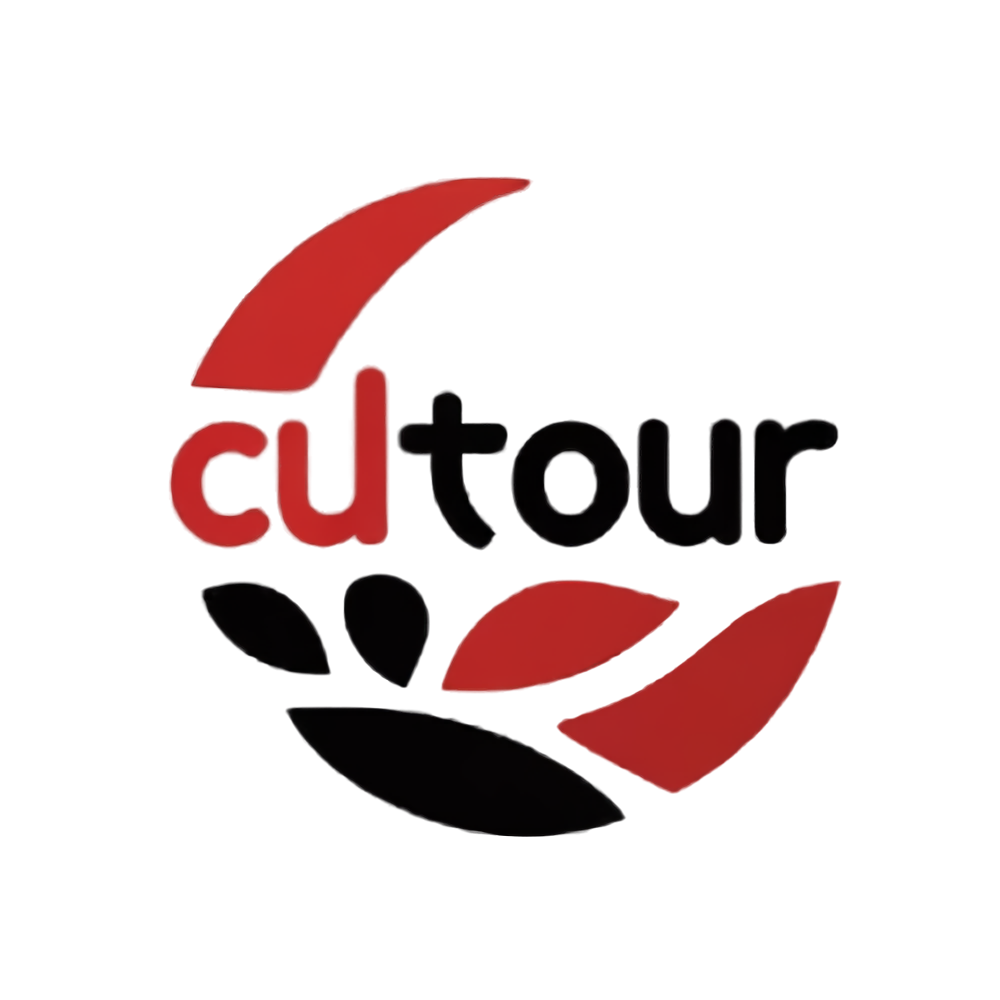

<div align="center">
  
  <h1>Cultour</h1>
</div>

<div align="center">
  
  
  
</div>

<br />

<div align="center">
  
  
  
  
  
  
</div>

<br />

<p align="center">
  <strong>Smart & Disability-Friendly Exploration of Batak Culture in the Lake Toba Ecosystem, North Sumatra.</strong>
</p>

## Executive Summary

**Cultour** is an integrated mobile application (Android & iOS) that combines artificial intelligence (AI), language translation, and interactive maps to enrich the Batak cultural tourism experience in Lake Toba, making it inclusive and educational. This app is designed from the ground up to be easy to use and accessible for all tourists, including those with disabilities (low vision / visually impaired).

## Key Features

- **Smart AI Camera**: Real-time identification and detection of cultural objects (traditional houses, statues, ulos) with historical narration using TensorFlow Lite.
- **Batak Language Tutor AI**: A virtual assistant chatbot for interactive learning of the Batak language (Karo, Toba, Simalungun) with instant translation.
- **Cultural NFT Collection**: A Web3-based virtual souvenir feature where users can collect *Digital Stamps* (NFTs) into their app wallet after visiting heritage sites.
- **Tourist Map & Navigation**: Interactive maps (Google Maps API) displaying lists of popular destinations and providing route guidance in the Lake Toba region.
- **Accessibility & Inclusivity**: Equipped with Text-to-Speech (TTS), Speech-to-Text (STT), High Contrast Mode, and Large Text settings to meet digital accessibility standards.

---

## Tech Stack & Core Systems

| Category | Technology |
| --- | --- |
| **Mobile App Frontend** | Flutter (Dart ≥3.5.0) |
| **Backend & BaaS** | Firebase (Authentication, Realtime DB, Cloud Storage) |
| **AI / Machine Learning** | TensorFlow Lite, MediaPipe, OpenAI API (NLP) |
| **Blockchain / Web3** | Polygon Network, IPFS (InterPlanetary File System) |
| **Integrations**| Google Maps API, Google Places, Platform Native Text-to-Speech |

---

## Project Structure

This project follows a feature-based Clean Architecture approach:

```text
cultour-app/
├── android/               # Application configuration directory for the Android platform
├── ios/                   # Application configuration directory for the iOS platform
├── assets/                # Static application assets (images, icons, fonts, etc.)
├── lib/                   # Main Flutter application source code
│   ├── core/              # Application core (configuration, DI, themes, utils, error handling)
│   ├── features/          # Main application features (Feature-based structure)
│   │   ├── camera/        # Smart AI Camera & scanning module
│   │   ├── home/          # Home & information dashboard module
│   │   ├── language/      # Batak Language Tutor & Chatbot module
│   │   ├── maps/          # Interactive Map & Tourist Navigation module
│   │   └── profile/       # Profile & Digital Stamp Collection (NFT) module
│   ├── shared/            # Global components and widgets used across multiple features
│   └── main.dart          # Application entry point
├── pubspec.yaml           # Flutter package configuration & dependencies file
├── application-desc.md    # Detailed description & functional design of the GEMASTIK proposal
└── README.md              # Main project guide & documentation file
```

Each feature in the `features/` folder generally has the following structure breakdown (based on Clean Architecture):
- `data/`: Models, Data Sources (Remote/Local), Repository Implementation.
- `domain/`: Entities, Use Cases, Repository Contracts.
- `presentation/`: BLoC/Cubit (State Management) and UI/Screen Widgets.

---

## How to Run the Application

The Cultour application is built natively for mobile platforms using the Flutter SDK.

### System Prerequisites
Ensure your operating system has the following installed:
- [Flutter SDK](https://flutter.dev/) (version 3.5.0 or above)
- [Android Studio](https://developer.android.com/studio) (for Android emulation & build tools)
- [Xcode](https://developer.apple.com/xcode/) (for iOS emulation - macOS only)
- Physical Device or Simulator/Emulator.

---

### Running Manually (Development Mode)

1. Open a terminal in the root folder of this project.
2. Install Dart dependencies:
   ```bash
   flutter pub get
   ```
3. Generate required Podfiles for Apple targets (macOS / iOS developers only):
   ```bash
   cd ios
   pod install --repo-update
   cd ..
   ```
4. Set up Environment Variables or Keys (Optional / if applicable):
   *(Make sure the API keys for Google Maps or Firebase Configs such as `google-services.json` and `GoogleService-Info.plist` are correctly placed in the `android/app/` and `ios/Runner/` folders respectively).*
5. Run the application:
   ```bash
   flutter run
   ```

*(Note: To run on a specific platform, utilize `flutter run -d chrome` for web fallback testing, or explicit device names).*

---

## Development Team (Softwarium - GEMASTIK XVIII)

This platform is developed by Team "Softwarium" from Del Institute of Technology (IT Del) for the Software Development category of GEMASTIK XVIII 2025:
- **Jody Edriano Pangaribuan** (11323025) - Developer / Project Member
- **Andri Agung Exaudi Sigiro** (11323022) - Developer / Project Member
- **Yolanda Septania Saragih** (12S23050) - Developer / Project Member

**Supervising Lecturer:** 
Tegar Arifin Prasetyo, S.Si., M.Si.

<br />

> **License**: © 2025 Del Institute of Technology | Developed by Softwarium. All rights reserved.
